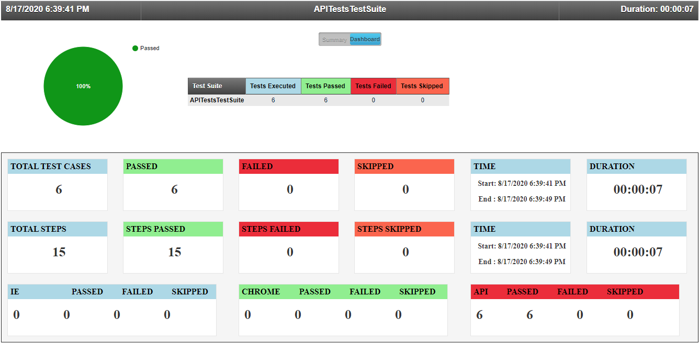

#  Restsharp-C#-Specflow-API-Tests
API tests using Restsharp, C# and Specflow

### Usage
Install-Package Test.Automation.Framework -Version 1.0.0.5

### Features
#### ▪ Authentications/ Authorizations
    ▪ Basic 
    ▪ NTLM 
    ▪ OAuth2
    ▪ Cookie
    ▪ Bearer
    ▪ Auto Token Generation
#### ▪ Supports Dynamic request creation
#### ▪ Response Code Validation
#### ▪ Response Content Validation
#### ▪ Response Schema Validation
#### ▪ Database Validations
#### ▪ Dynamically Add/ Replace/ Remove Request/ Response parameters
#### ▪ Dynamic Parsing of reponse with JArray/ JProeprty/ JObject irrespective of response structure
#### ▪ Serialization/ Deserialization
#### ▪ Get Response Count
#### ▪ Retrieve Response values by Key

### Interesting stuff: Scenario execution [HTML Reports](https://github.com/SandeepDhamale19/Restsharp-API-Tests/tree/master/TestAutomation.APITests/Results)
##### A. Test Suites: Summary [All passed]
 <kbd></kbd>
 <!---->
 
##### B. Test Suites: Dashboard
  <kbd><kbd>

 
